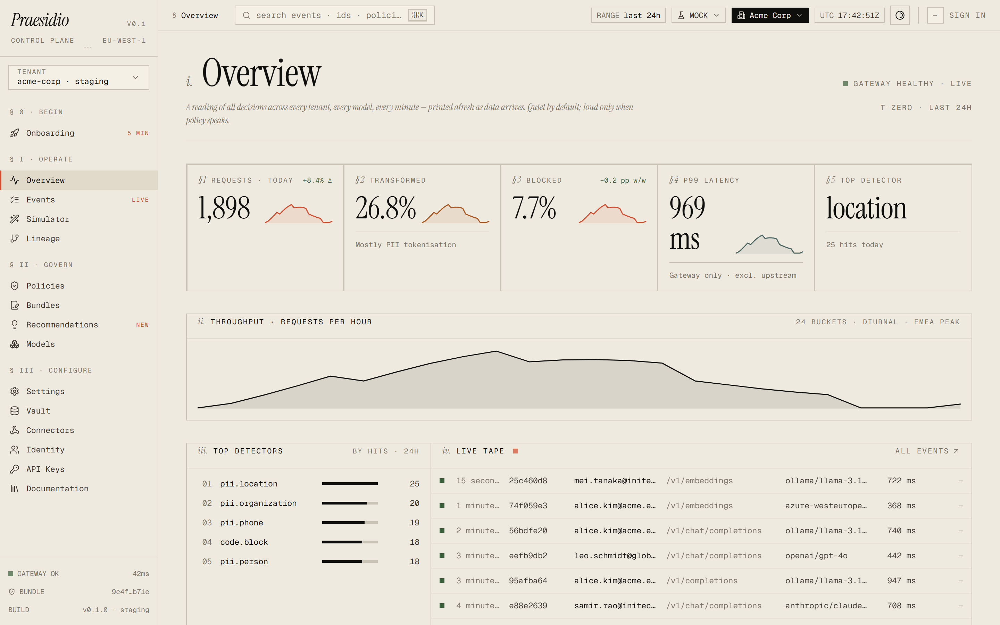

# Praesidio

<p align="center">
  
  <br/>
  <sub><i>The operator console. Every decision, every tenant, every model — printed afresh as data arrives.</i></sub>
</p>

**The AI Security Control Plane.** Semantic DLP, reversible anonymisation, and
runtime governance for every prompt, response, embedding, and agent action.

[](LICENSE)
[](https://github.com/cwellbournewood/praesidio/actions/workflows/ci.yml)
[](https://github.com/cwellbournewood/praesidio/actions/workflows/codeql.yml)
[](https://securityscorecards.dev/viewer/?uri=github.com/cwellbournewood/praesidio)

---

## Why

Traditional DLP looks for strings. AI leaks happen semantically — a developer
pastes a stack trace that names a customer; a copilot summarises a deal memo
into a retrieval index; an agent quietly emails a vendor list. Praesidio sits
in front of every LLM call, every retrieval, and every tool invocation, and
answers three questions before any of them touch a model:

1. **What is in this payload?** — entities, secrets, source code, regulated
   data, intent.
2. **Is this user allowed to send this to this model in this jurisdiction?**
3. **Can we keep the request useful by anonymising sensitive parts and putting
   them back on the way out?**

Yes → forward, log, lineage. No → block or transform, with a signed audit
record.

## Quick start

```bash
git clone https://github.com/cwellbournewood/praesidio.git
cd praesidio
cp .env.example .env
docker compose up --build
```

Point any OpenAI client at the gateway and send a prompt:

```bash
export OPENAI_BASE_URL=http://localhost:8080/v1
export OPENAI_API_KEY=praesidio-demo-key

curl http://localhost:8080/v1/chat/completions \
  -H "Authorization: Bearer $OPENAI_API_KEY" \
  -H "Content-Type: application/json" \
  -d '{
    "model": "gpt-4o-mini",
    "messages": [{"role":"user","content":"Email john.smith@acme.com about invoice 4471"}]
  }'
```

Open the admin UI at <http://localhost:3000>, or run the smoke demo:

```bash
bash scripts/demo.sh
```

Full walkthrough: [`docs/getting-started.md`](docs/getting-started.md).

## What's in the box

- **Gateway** — OpenAI- and Anthropic-compatible HTTP proxy with adapters for
  Azure OpenAI, AWS Bedrock, Ollama, and any OpenAI-compatible endpoint.
- **Semantic DLP** — regex, secrets, source-code, prompt-injection, and
  Microsoft Presidio NER detectors composed into one pipeline with a
  category-keyed label taxonomy.
- **Reversible anonymisation** — vault-backed tokenisation (AES-256-GCM,
  per-tenant HKDF), FF3-1 format-preserving encryption, and redaction —
  policy-selectable per entity. Streaming responses are chunk-boundary safe.
- **Policy as code** — YAML + CEL, cosign-signed bundles, race-safe
  hot-reload, `praesidio-policy lint`.
- **Audit & lineage** — Postgres-backed hash-chained event log with a
  `praesidio-audit verify` tamper CLI, SIEM webhook, and Splunk HEC sink.
- **Edge coverage** — Manifest V3 browser extension (6 consumer AI sites),
  VS Code + JetBrains extensions, and a local CA proxy that brings Cursor,
  Claude Code, Continue, aider, Cline, Copilot CLI, and Zed into compliance.
- **Vector connectors** — pgvector and Qdrant with scan-on-write and
  retrieval ACL enforcement.
- **Admin UI** — events, policies, lineage DAG, simulator, detokenise
  workflow, command palette. Light-first, AAA-accessible.
- **Production deploy** — Helm chart with HA, NetworkPolicies, and External
  Secrets; Terraform reference modules for AWS, Azure, and GCP; Kubernetes
  `ValidatingAdmissionPolicy` and Gatekeeper templates.
- **Supply chain** — every release is cosign-signed, ships a CycloneDX SBOM
  per image, and carries SLSA-3 build provenance.

## Architecture

```
                                       +----------------------------+
  server-side apps,                    |     Praesidio Gateway      |
  agents, CI       ------------------> |                            | -->  OpenAI / Anthropic
                                       |                            | -->  Azure OpenAI / Bedrock
  edge browser extension               |   +--------+  +--------+   | -->  Gemini / Cohere / Mistral
  (ChatGPT, Claude.ai, --/v1/scan----> |   | Policy |  |  DLP   |   | -->  Ollama / vLLM
   Gemini, Copilot,         /v1/restore|   | engine |<-+ engine |   | -->  sovereign / local
   Perplexity, Mistral)                |   +---+----+  +---+----+   |
                                       |       |           |        |
  local CA proxy                       |       v           v        |
  (Cursor, Claude Code, --HTTPS_PROXY->|   +-------------------+    |
   Continue, aider, Cline,             |   | Anonymiser +      |    |
   Copilot CLI, Zed)                   |   | Token Vault       |    |
                                       |   +---------+---------+    |
  VS Code, JetBrains    --/v1/scan---> +-------------+--------------+
  (scan-selection,                                   |
   diagnostics, tokenise)                            |
                                                     v
                             +-----------------------+-----------------------+
                             |                       |                       |
                             v                       v                       v
                       +-----------+           +-----------+           +-----------+
                       | Postgres  |           |   Redis   |           | Admin UI  |
                       | audit +   |           |   vault   |           | (Next.js) |
                       | lineage   |           | (token -> |           |           |
                       |           |           |  secret)  |           |           |
                       +-----------+           +-----------+           +-----------+
```

Deeper dives in [`docs/architecture/`](docs/architecture/).

## Documentation

- [Getting started](docs/getting-started.md) — install, first request, first
  policy
- [Architecture overview](docs/architecture/00-overview.md)
- [Threat model](docs/threat-model.md)
- [Operations](docs/operations/) — observability, OIDC, signed bundles,
  backup/restore, disaster recovery, edge install
- [Compliance mappings](docs/compliance/) — EU AI Act, GDPR, HIPAA, SOC 2,
  ISO 27001, NIST AI RMF, CRA
- [Architecture decision records](docs/adr/)
- [Edge coverage matrix](docs/edge-coverage-matrix.md)

## Security

Vulnerability disclosures go through [GitHub Private Vulnerability
Reporting](https://github.com/cwellbournewood/praesidio/security/advisories/new).
See [`SECURITY.md`](SECURITY.md) for the disclosure SLA and scope.

Every release is cosign-signed with verifiable GitHub OIDC identity. Each
image ships a CycloneDX SBOM and a SLSA-3 build provenance attestation;
verification recipes are in
[`docs/security/supply-chain.md`](docs/security/supply-chain.md).

## License

Apache 2.0 — see [LICENSE](LICENSE). Built to be forked, audited, and
self-hosted.
